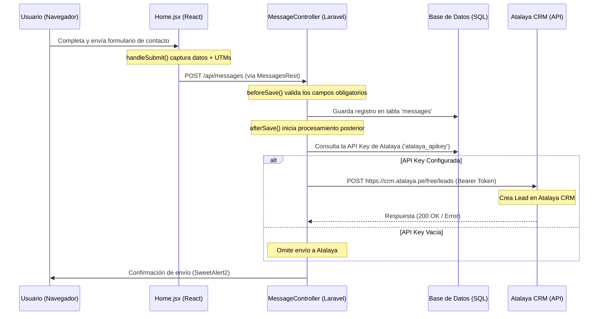

# Integración de Atalaya CRM - Envío de Leads (API Key)

Este documento explica cómo funciona la integración del formulario de contacto de la Landing Page con **Atalaya CRM** utilizando la clave de API (API Key), desde la configuración en el panel de administración hasta la transmisión de datos del frontend al backend y finalmente al endpoint externo de Atalaya.

---

## 1. Arquitectura y Flujo de Datos

El flujo completo cuando un usuario envía un mensaje/formulario de contacto es el siguiente:



---

## 2. Configuración de la API Key en el Panel de Administración

La API Key de Atalaya se almacena dinámicamente en la base de datos para facilitar su mantenimiento sin necesidad de modificar el código fuente o variables de entorno `.env`.

* **Componente React:** [Generals.jsx](file:///c:/xampp/htdocs/projects/landing_ngssolutions/resources/js/Admin/Generals.jsx#L1570-L1616)
* **Llave en Base de Datos (`correlative`):** `atalaya_apikey` (dentro de la tabla `generals`)
* **Ubicación en el Panel:** Sección **Atalaya CRM** en la configuración general.

---

## 3. Envío desde el Frontend (React)

El formulario de asesoría en la landing page recopila los datos y los envía al backend Laravel.

* **Componente React:** [Home.jsx](file:///c:/xampp/htdocs/projects/landing_ngssolutions/resources/js/Home.jsx#L417-L430)
* **Controlador de API REST:** [MessagesRest.js](file:///c:/xampp/htdocs/projects/landing_ngssolutions/resources/js/actions/MessagesRest.js)

### Código Relevante (`handleSubmit`):
```javascript
const handleSubmit = async (e) => {
    e.preventDefault();
    setIsSubmitting(true);
    const subject = "Solicitud de Asesoría Comercial - NGS Solutions";
    const description = `Empresa: ${company || "No especificada"} | Mensaje: ${details || "Sin detalles adicionales"}`;
    try {
        const result = await messagesRest.save({ 
            name, 
            email, 
            phone, 
            company, 
            subject, 
            description, 
            ...getStoredUTMs() // Adjunta parámetros de campaña UTM
        }, null, false);
        
        if (!result) throw new Error();
        
        Swal.fire({ 
            title: "¡Solicitud Recibida!", 
            text: "Nos pondremos en contacto con usted en menos de 24 horas.", 
            icon: "success", 
            confirmButtonColor: "#d57748" 
        });
        
        // Resetear inputs del formulario...
    } catch (error) {
        Swal.fire({ 
            title: "Error", 
            text: "Hubo un problema al enviar su solicitud. Por favor, intente nuevamente.", 
            icon: "error", 
            confirmButtonColor: "#60a9be" 
        });
    } finally { 
        setIsSubmitting(false); 
    }
};
```

---

## 4. Procesamiento y Reenvío en el Backend (Laravel)

Cuando la API de Laravel recibe la petición en `POST /api/messages`, el controlador [MessageController.php](file:///c:/xampp/htdocs/projects/landing_ngssolutions/app/Http/Controllers/MessageController.php) procesa la información en dos fases:

### Fase A: Validación (`beforeSave`)
Se encarga de verificar que los campos requeridos estén presentes y correctos (`name`, `email`, `phone`, `description`).

### Fase B: Envío a Atalaya CRM (`afterSave`)
Una vez persistido el mensaje, se ejecuta de forma síncrona el envío a Atalaya si y solo si existe la API Key guardada:

```php
public function afterSave(Request $request, object $jpa, bool $isNew)
{
    $jpa->load('service', 'facility');
    MailingController::notifyContact($jpa);

    // Obtener la API Key desde la tabla Generals
    $atalayaApiKey = \App\Models\General::where('correlative', 'atalaya_apikey')->value('description');
    
    if (!empty($atalayaApiKey)) {
        try {
            \Illuminate\Support\Facades\Http::withHeaders([
                'Content-Type' => 'application/json',
                'Authorization' => 'Bearer ' . $atalayaApiKey,
            ])->post('https://crm.atalaya.pe/free/leads', [
                'contact_name' => $jpa->name,
                'contact_phone' => $jpa->phone,
                'contact_email' => $jpa->email,
                'tradename' => $jpa->company ?? '',
                'message' => $jpa->description ?? '',
                'origin' => 'Landing Page',
                'utm_source' => $jpa->utm_source ?? '',
                'utm_medium' => $jpa->utm_medium ?? '',
                'utm_campaign' => $jpa->utm_campaign ?? '',
                'utm_term' => $jpa->utm_term ?? '',
                'utm_content' => $jpa->utm_content ?? '',
                'web_url' => $request->header('referer') ?? url()->previous(),
                'referrer' => $request->header('referer') ?? '',
            ]);
        } catch (\Throwable $th) {
            // El fallo de la API de Atalaya se registra en logs pero no detiene el flujo del usuario
            \Illuminate\Support\Facades\Log::error('Excepción enviando lead a Atalaya: ' . $th->getMessage());
        }
    }
}
```

---

## 5. Especificaciones de la API de Atalaya

### Endpoint
* **Método:** `POST`
* **URL:** `https://crm.atalaya.pe/free/leads`

### Cabeceras (Headers)
| Cabecera | Valor |
|---|---|
| `Content-Type` | `application/json` |
| `Authorization` | `Bearer [API_KEY_CONFIGURADA]` |

### Estructura del Cuerpo (JSON Body)
El backend mapea los atributos del modelo `Message` y datos del navegador a los campos esperados por Atalaya:

```json
{
  "contact_name": "Nombre completo ($jpa->name)",
  "contact_phone": "Teléfono ($jpa->phone)",
  "contact_email": "Correo electrónico ($jpa->email)",
  "tradename": "Empresa / Nombre comercial ($jpa->company)",
  "message": "Detalle del requerimiento ($jpa->description)",
  "origin": "Landing Page",
  "triggered_by": "Formulario Landing",
  "web_url": "URL exacta actual del navegador",
  "referrer": "Página de origen / Referer",
  "x_breakdown_id": "ID de sesión de Atalaya Pixel (si existe)",
  "utm_source": "meta, google, tiktok, linkedin, etc. (Si no se envía, Atalaya lo clasifica como 'Orgánico')",
  "utm_medium": "cpc, paid, ads (Tipo/Proceso: Anuncio)",
  "utm_campaign": "Nombre de la campaña",
  "utm_term": "Grupo de anuncios o palabra clave",
  "utm_content": "Nombre o ID del anuncio"
}
```

### Reglas de Clasificación de UTMs en Atalaya CRM
| Parámetro | Valores Recomendados | Proceso en Atalaya CRM |
|---|---|---|
| `utm_source` | `meta`, `facebook`, `instagram`, `messenger`, `whatsapp` | Asigna Origen: **Meta** |
| `utm_source` | `google`, `googleads` | Asigna Origen: **Google** |
| `utm_source` | `tiktok` | Asigna Origen: **TikTok** |
| `utm_source` | `linkedin` | Asigna Origen: **LinkedIn** |
| `utm_source` | *(No enviado o no especificado)* | Asigna Origen: **Orgánico** |
| `utm_medium` | `cpc`, `paid`, `ads` | Clasificado como Proceso/Tipo: **Anuncio** |
| `utm_campaign` | Nombre de la campaña | Vincula/Crea la **Campaña** en Atalaya |
| `utm_term` | AdSet / Palabra clave | Guarda el **Grupo de Anuncios** |
| `utm_content` | Creativo / ID del anuncio | Guarda el **Anuncio** |
| `triggered_by` | `Formulario Landing` | Registra el disparador de entrada del lead |

---

## 6. Manejo de Errores y Tolerancia a Fallos
* **Aislamiento:** El envío HTTP está encerrado en un bloque `try-catch` capturando cualquier `Throwable`. Si el servidor de Atalaya está caído, retorna un error de timeout, o rechaza el token, la landing page **no mostrará un error al cliente final**; en su lugar, se registrará el error silenciosamente en el archivo de logs de Laravel (`storage/logs/laravel.log`) para auditoría técnica.
* **Seguridad:** La API Key nunca se expone al cliente del frontend (navegador). Todas las llamadas externas a Atalaya se ejecutan de manera segura a nivel de servidor (servidor a servidor).
