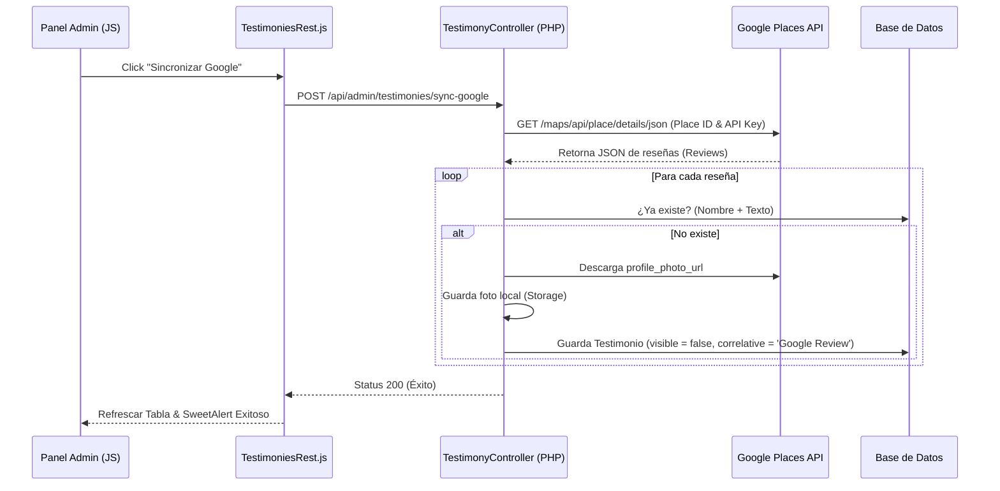

# Sincronización de Testimonios con Google Reviews

Este documento explica cómo funciona la integración y sincronización de testimonios (reseñas) de Google Places en la plataforma. Está diseñado para que cualquier desarrollador pueda configurar, mantener o replicar esta lógica.

---

## 1. Configuración de Variables de Entorno (`.env`)
Para que la integración funcione, se deben configurar las siguientes credenciales en el archivo `.env` del backend:

```env
# API Key de Google Cloud con el servicio "Places API" habilitado
GMAPS_API_KEY=AIzaSy...

# ID del establecimiento en Google Maps (Place ID)
GOOGLE_PLACE_ID=ChIJ...
```

> [!NOTE]
> * **Google Places API**: Debe estar habilitada en la consola de Google Cloud para la API Key utilizada.
> * **Place ID**: Se puede obtener usando la herramienta oficial de Google: [Place ID Finder](https://developers.google.com/maps/documentation/places/web-service/place-id).

---

## 2. Flujo de Datos e Integración

El proceso de sincronización permite importar las últimas reseñas de Google en la base de datos local y administrarlas desde el panel administrativo.



---

## 3. Detalle de Implementación Backend

### Ruta del API
**Archivo:** [routes/api.php](file:///c:/xampp/htdocs/projects/quiroinnova_backend/routes/api.php)
```php
Route::post('/testimonies/sync-google', [AdminTestimonyController::class, 'syncGoogle']);
```

### Controlador
**Archivo:** [TestimonyController.php](file:///c:/xampp/htdocs/projects/quiroinnova_backend/app/Http/Controllers/Admin/TestimonyController.php#L26-L104)

    public function syncGoogle(Request $request)
    {
        $response = new Response();
        try {
            $key = env('GMAPS_API_KEY');
            $placeId = env('GOOGLE_PLACE_ID');

            if (!$key || !$placeId) {
                throw new Exception('Faltan las llaves de Google en el archivo .env (GOOGLE_MAPS_API_KEY o GOOGLE_PLACE_ID)');
            }

            $lang_id = $request->lang_id;
            $lang = null;
            if ($lang_id) {
                $lang = Lang::find($lang_id);
            }
            if (!$lang) {
                $lang = Lang::where('is_default', true)->first() ?? Lang::first();
                $lang_id = $lang ? $lang->id : null;
            }

            $langCode = $lang ? ($lang->description ?? 'es') : 'es';

            $googleResponse = Http::get("https://maps.googleapis.com/maps/api/place/details/json", [
                'place_id' => $placeId,
                'fields' => 'reviews,rating,user_ratings_total',
                'key' => $key,
                'language' => $langCode
            ]);

            if ($googleResponse->failed()) {
                throw new Exception('Error al comunicarse con Google Maps API');
            }

            $data = $googleResponse->json();
            if (($data['status'] ?? '') != 'OK') {
                throw new Exception('Google API Error: ' . ($data['error_message'] ?? $data['status'] ?? 'Unknown error'));
            }

            $result = $data['result'] ?? [];
            $reviews = $result['reviews'] ?? [];

            foreach ($reviews as $review) {
                // Generar un correlativo único para evitar duplicados
                $check = Testimony::where('name', $review['author_name'])
                    ->where('description', $review['text'])
                    ->first();

                if (!$check) {
                    $imageName = null;
                    // Intentar descargar la imagen del autor para que no expire
                    if (!empty($review['profile_photo_url'])) {
                        $imageContent = Http::get($review['profile_photo_url'])->body();
                        $imageName = Str::uuid() . '.jpg';
                        Storage::put('images/testimony/' . $imageName, $imageContent);
                    }

                    Testimony::create([
                        'name' => $review['author_name'],
                        'description' => $review['text'],
                        'rating' => $review['rating'],
                        'correlative' => 'Google Review',
                        'visible' => false,
                        'status' => true,
                        'image' => $imageName,
                        'lang_id' => $lang_id
                    ]);
                }
            }

            $response->status = 200;
            $response->message = 'Sincronización completada exitosamente';
        } catch (\Throwable $th) {
            $response->status = 400;
            $response->message = $th->getMessage();
        } finally {
            return response($response->toArray(), $response->status);
        }
    }
El método `syncGoogle` realiza los siguientes pasos:
1. **Validación**: Verifica que `GMAPS_API_KEY` y `GOOGLE_PLACE_ID` estén configurados.
2. **Consumo de API**: Realiza una petición GET a la API de Place Details:
   `https://maps.googleapis.com/maps/api/place/details/json` solicitando únicamente los campos `reviews,rating,user_ratings_total` y traduciendo las respuestas según el idioma activo del sistema.
3. **Prevención de Duplicados**: Antes de registrar, valida si ya existe un testimonio con el mismo autor (`name`) y mismo contenido (`description`).
4. **Descarga y Caché de Imágenes**: Las URLs de fotos de perfil de Google pueden expirar. Por ello, el servidor descarga la imagen del autor (`profile_photo_url`), genera un UUID y la almacena localmente en la carpeta `images/testimony/` del Storage.
5. **Persistencia**: Registra el testimonio con `visible => false` (inactivo por defecto) y `correlative => 'Google Review'`.

---

## 4. Detalle de Implementación Frontend

### Servicio REST
**Archivo:** [TestimoniesRest.js](file:///c:/xampp/htdocs/projects/quiroinnova_backend/resources/js/actions/Admin/TestimoniesRest.js)
Define la petición hacia el endpoint backend:
```javascript
syncGoogle = async () => {
    try {
        return await (await fetch(`/api/${this.path}/sync-google`, {
            method: "POST",
            headers: {
                "Content-Type": "application/json",
                "X-Xsrf-Token": decodeURIComponent(Cookies.get("XSRF-TOKEN"))
            }
        })).json();
    } catch (error) {
        console.error(error);
        return null;
    }
}
```

### Vista Administrativa
**Archivo:** [Testimonies.jsx](file:///c:/xampp/htdocs/projects/quiroinnova_backend/resources/js/Admin/Testimonies.jsx)
1. **Botón en Toolbar**: Añade un botón con el icono de Google (`fab fa-google`) llamado "Sincronizar Google".
2. **Confirmación**: Al hacer clic, muestra un diálogo SweetAlert2 confirmando la acción e informando al usuario que se guardarán como "No Visibles".
3. **Proceso**: Llama al método `testimoniesRest.syncGoogle()`, muestra un indicador de carga (`Swal.showLoading()`), y refresca la tabla DevExtreme DataGrid al finalizar.
4. **Moderación**: Como las reseñas se guardan con `visible: false`, el administrador puede activarlas o desactivarlas usando el componente `SwitchFormGroup` en la columna "Visible".

---

## 5. Limitaciones de Google Places API
* **Límite de Reseñas**: Por defecto, la API de detalles de Google Places **solo retorna las 5 reseñas más relevantes** del perfil de negocio. No es una limitación del sistema, sino una restricción nativa de Google.
* Si requieres un histórico total, se debe implementar una API de pago de terceros o cargarlas manualmente con el botón "Nuevo Testimonio".
